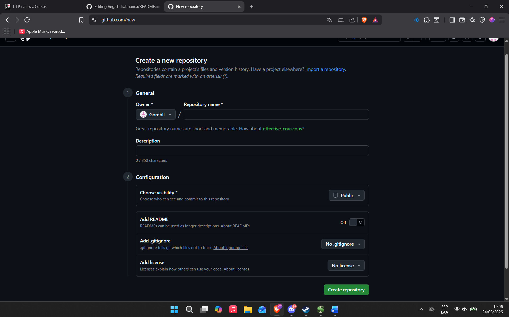
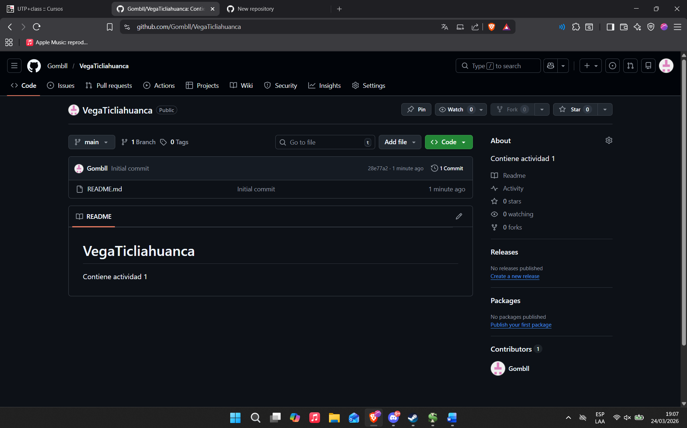

# VegaTicliahuanca
Contiene actividad 1
## Proceso de Creacion de Repositorio
* Presionamos el icono + en la parte superior derecha como en la imagen

* Introducimos el nombre de nuestro repositorio y su visibilidad Publica o Privada segun requiera

* Por ultimos presionamos el boton verde y se creara nuestro repositorio
* 
